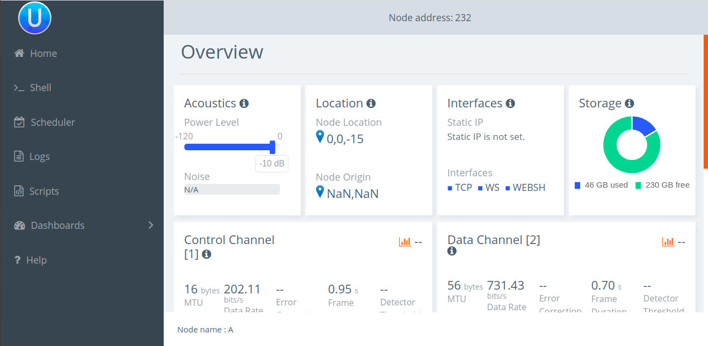

# UnetStack
This page provides a solution to UnetStack simulation related issues

# Issue-1
In the simulation of 2-node-network.groovy in unet-3.1.0, shell browser for node 1 and 2 looks as follows,

